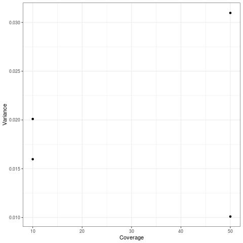
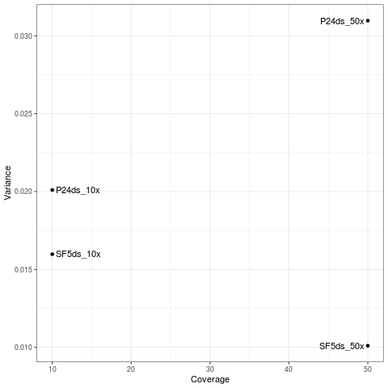
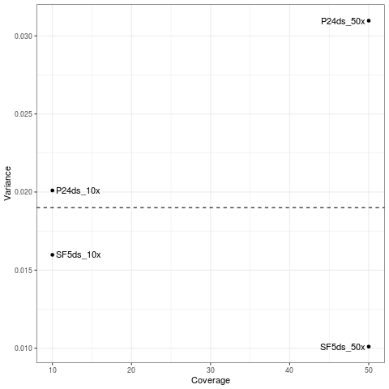
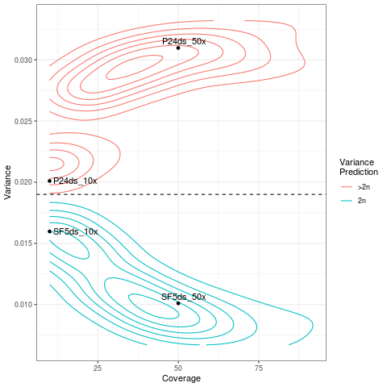
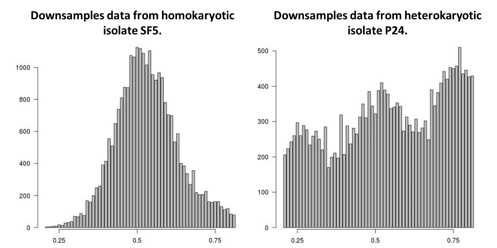

# Walkthrough
The directory `data` contains four variance call files (VCFs) which can be used to create the images below. These VCFs have been randomly downsampled to 100,000 variant lines so they can be posted on GitHub. To run VCFvariance:
```
perl ../VCFVariance.pl -i data/SF5ds_10x.vcf
```
A new file called `Variance.log` is now in the current working directory, looking in this we can see the results of VCFvariance:
```
cat Variance.log
Input VCF       Coverage        -d      -p      HQ Variants Analyzed    % HQ Hets       Variance
data/SF5ds_10x.vcf      10      0.4     80      20515   94.7    0.0159798717907211
```
Because this sample has a variance under 0.019 we would classify it as a diploid, which is correct.\
We can now run all the other VCFs through VCFvariance.pl:
```
perl ../VCFVariance.pl -i data/SF5ds_50x.vcf
perl ../VCFVariance.pl -i data/P24ds_10x.vcf
perl ../VCFVariance.pl -i data/P24ds_50x.vcf
```
Now we have results for all 4 VCFs in the `Variance.log` file. 
```
cat Variance.log
Input VCF       Coverage        -d      -p      HQ Variants Analyzed    % HQ Hets       Variance
data/SF5ds_10x.vcf      10      0.4     80      20515   94.7    0.0159798717907211
data/SF5ds_50x.vcf      50      0.4     80      25780   99.4    0.0100999156041764
data/P24ds_10x.vcf      10      0.4     80      14198   86.6    0.0200998402844798
data/P24ds_50x.vcf      50      0.4     80      19465   89.7    0.0309686259792236
```
We can see that SF5 is consistent with diploidy at both coverages (expected), because the variance of allele balance is below 0.019. Isolate P24 is inconsistent with diploidy (expected), because the variance of allele balance is above 0.019.
We can plot these data in R using ggplot2.
```
R
dat <- read.table("Variance.log", sep='\t', header=T)
library(ggplot2)
p <- ggplot(dat, aes(x=Coverage,y=Variance))+geom_point()+theme_bw()
p
```

If we want to add labels to the data we can do this by subsetting the first column
```
dat$label <- sub(".*/","", dat$Input.VCF)
dat$label <- sub(".vcf","", dat$label)
library(ggrepel)
p <- p+geom_text_repel(aes(label=label))
p
```

We can also add a horizontal line at 0.019, which is used for the cut off for diploidy.
```
p <- p+geom_hline(yintercept=0.019, linetype="dashed")
p
```

Finally we can add the contours reported in Figure 3 and 5 to 8 in the paper.
```
cont <- read.table("data/BlacContours.txt", sep='\t', header=T)
p <- ggplot(dat, aes(x=Coverage,y=Variance))+
geom_density_2d(data=cont, aes(x=Depth,y=Variance, color=Karyon))+scale_color_discrete(name="Variance\nPrediction",labels=c(">2n","2n")) +
geom_point() +
geom_text_repel(aes(label=label)) +
theme_bw()+
geom_hline(yintercept=0.019, linetype="dashed")
p
```

In addition, histograms of allele balance can be printed with the script.
```
perl ../VCFVariance.pl -i data/SF5ds_50x.vcf -B
perl ../VCFVariance.pl -i data/P24ds_50x.vcf -B
```
This will result in two new files in the current working directory called `SF5ds_50x.jpg` and `P24ds_50x.jpg` which look like the below.

