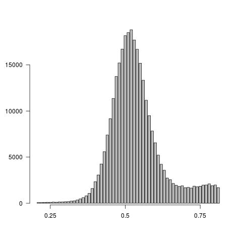
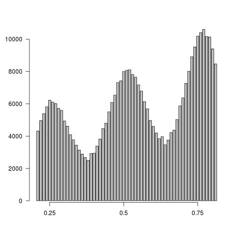

# VCFvariance.pl

VCFvariance.pl is a script used to calculate the variance of allele balance for SNPs in a VCF file, called with FreeBayes (tested on v1.2).

Variance of allele balance can be used to determine if the variants in a VCF are consistent with diploidy. The expectation for a diploid is that reads will sample two haplotypes equally, meaning half the reads covering SNPs will represent the first genotype. The other half of the reads will represent the second genotype. This means that the allele balance for diploids should be approximately 0.5 and there should be low variance of allele balance within the sample.

Genomes inconsistent with diploidy (those exhibiting polyploidy, heterokaryosis, large scale copy number variation) will exhibit a larger variance of allele balance since they have more than two haplotypes. For example, in a triploid allele balance would be expected to be 0.33/0.67. This will increase the varaince of allele balance within the sample allowing detection.

This method is sensitive down to 10x whole genome sequencing coverage.

## Download
`git clone git@github.com:kfletcher88/VCFvariance.git`

## Usage
```
perl VCFvariance.pl -h
        Please provide:
                -i input VCF
                -c Coverage of input sample.
                Coverage may also be provided in the filename,
                preceeded by an underscore, followed by an x e.g:

                        SampleID_10x.vcf

        Optional flags include:
        -p Percent Haploid Flag (default 80). # This can be set to zero if haploidy is not possible.
                Percentage of SNPS required to pass allele balance filter
		
       -d Deviation from defined coverage allowed (default 0.4).
                Increase deviation from coverage to increase number of SNPs surveyed.

       -B Print the allele balance histograms for the input VCF.
                Recommened only when coverage exceeds 50x
```

## Results
VCFvariance.pl will output a tab-delimited text file describing:
1. The input file name
2. Use specified coverage
3. User specified deviation from coverage (default = 0.4)
4. User specified percent of polymorphisms heterozyous (default = 80) to filter haploids.
5. Number of high quality polymorphisms identified
6. Percent of high quality polymorphisms inferred to be heterozygous.
7. Variance of allele balance for polymorphisms.

**An example:**
```
Input VCF	Coverage	-d	-p	HQ Variants Analyzed	%HQ Hets	Variance
SF5_164x.vcf	164		0.4	80	297282			98.7		0.00788016117413868
```

## Plotting allele balance histograms
Option `-B` allows users to plot allele balance histograms. This is only reccomended when 50x or greater sequencing coverage has been obtained.\
**An example plot of a histogram <ins>consistent</ins> with diploidy:**





**An example plot of a histogram <ins>inconsistent</ins> with diploidy:**



